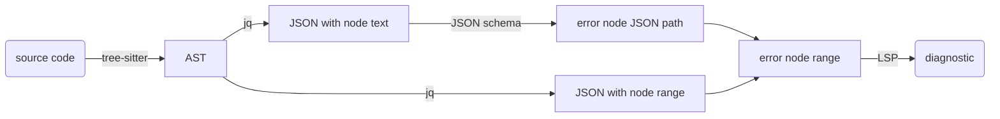
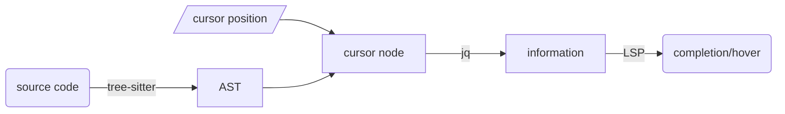

# lsp-tree-sitter

A library to create language servers.

## Features

- [x] [textDocument/documentLink](https://microsoft.github.io/language-server-protocol/specifications/lsp/3.18/specification/#textDocument_documentLink)
- [x] [textDocument/publishDiagnostics](https://microsoft.github.io/language-server-protocol/specifications/lsp/3.18/specification/#textDocument_publishDiagnostics)
- [x] [textDocument/hover](https://microsoft.github.io/language-server-protocol/specifications/lsp/3.18/specification/#textDocument_hover)
- [x] [textDocument/completion](https://microsoft.github.io/language-server-protocol/specifications/lsp/3.18/specification/#textDocument_completion)

## Examples

- [mutt-language-server](https://github.com/neomutt/mutt-language-server)
  
- [tmux-language-server](https://github.com/Freed-Wu/tmux-language-server)
  
- [zathura-language-server](https://github.com/Freed-Wu/zathura-language-server)
  
- [termux-language-server](https://github.com/termux/termux-language-server)
  
- [requirements-language-server](https://github.com/Freed-Wu/requirements-language-server)
  
- [autotools-language-server](https://github.com/Freed-Wu/autotools-language-server)
  
